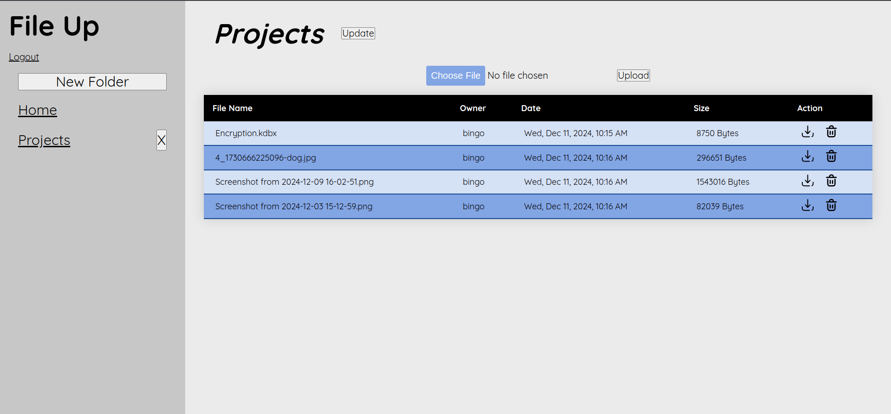

# file-uploader

>  [Live Website](https://file-uploader-production-ea4f.up.railway.app/)

## Preview



## Tools/Languages

[](#)  [](#)  [](#)

[](#)  [](#) [](#)
[](#)
[](#)

## Getting Started
- Create a `.env` file with all variables
- Make sure to have PostgreSQL

```
$ git clone git@github.com:immacheetah/file-uploader.git
$ cd file-uploader
$ npm install
$ npm prisma migrate dev
$ npm run start
```

## Learning Outcomes

- Use prisma to create a data relationship between models
- Create a file management system
 - Learn how to upload files to a cloud storage
 - Store files safely using personal buckets for the user
- Cement authentication practices using passport